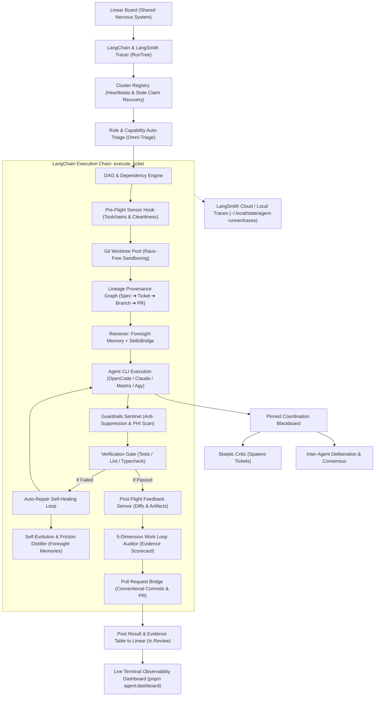

# Linear Multi-Agent Coordination Runner (2026 MAS Architecture)

> Autonomous multi-agent coordination architecture powered by Linear as a shared
> nervous system, external blackboard, LangChain tracing, 5-Dimension Work Loop
> auditing, and recursive self-evolution.

---

## 1. ⚡ Complete System Architecture



---

## 2. 🌟 The 4 Advanced MAS Upgrades (Inspired by Exo & Better Harness)

### 1. 📊 5-Dimension Work Loop Quality & Evidence Auditor ([`loop_auditor.py`](file:///home/vivi/pixelated/tools/agent_runner/loop_auditor.py))

Evaluates the 5 essential dimensions of agent software delivery for every
completed task:

- 🎯 **Task Understanding**: Explicit acceptance criteria and bounded
  specifications.
- 🧭 **Controlled Execution**: Sandbox isolation in dedicated Git worktrees with
  specialist alignment.
- ✅ **Change Validation**: Automated test pass rates, typecheck clean runs, and
  attached diagnostic proof.
- 🚢 **Reliable Delivery**: Strict zero-tolerance anti-suppression audits
  (`@ts-ignore`, `# noqa`) and HIPAA/PHI isolation.
- 🧠 **Learning Capture**: Persistent architectural decisions and state signals
  captured to Foresight.

Outputs an **Evidence Badge** (e.g. `Work Loop Evidence: 94% (A)`) and a
structured Markdown evidence breakdown table directly onto Linear tickets.

---

### 2. 🛡️ Pre-Flight Feedforward & Post-Flight Feedback Sensors ([`sensor_hooks.py`](file:///home/vivi/pixelated/tools/agent_runner/sensor_hooks.py))

- **Pre-Flight Hook**: Verifies toolchain binaries (`pnpm`, `uv`, `git`), agent
  executable reachability, and working tree cleanliness before agent startup.
- **Post-Flight Hook**: Audits git status, validates modified files against
  expected target scopes, and detects any leftover temporary scratch files.

---

### 3. 🧬 Provenance Lineage Graph Tracker ([`lineage.py`](file:///home/vivi/pixelated/tools/agent_runner/lineage.py))

Maintains an append-only provenance graph connecting:
`Specification ➔ Linear Project ➔ Task DAG ➔ Worktree Branches ➔ Delegations ➔ Pull Requests ➔ Foresight Memories`

- Inspect lineage trees in Mermaid format via `pnpm agent:lineage`.

---

### 4. 🧠 Self-Evolution & Friction Distillation Engine ([`self_evolution.py`](file:///home/vivi/pixelated/tools/agent_runner/self_evolution.py))

- Automatically diagnoses compiler errors, type mismatches, and auto-repair
  retry cycles.
- Distills actionable engineering directives (e.g. _"Ensure all TypeScript
  imports match workspace tsconfig definitions"_) and stores them directly in
  **Foresight Persistent Memory** (`category="lesson"`).
- View recent evolution lessons via `pnpm agent:evolution`.

---

## 3. 🛠️ CLI Quick Commands

```bash
# 1. Spec Initializer: Ingest a PRD/Spec and deploy a phased Linear Project DAG
pnpm agent:plan path/to/spec.md --team PIX --name "FHIR EHR Upgrade"
pnpm agent:plan path/to/spec.md --team PIX --dry-run  # Preview mode

# 2. View Provenance Lineage Graph (Mermaid)
pnpm agent:lineage
pnpm agent:lineage --root PIX-4610

# 3. View Self-Evolution Lessons Learned
pnpm agent:evolution

# 4. Live Cluster Observability Dashboard
pnpm agent:dashboard

# 5. Inspect Immutable State Event Ledger
pnpm agent:events

# 6. Execute Single Polling Evaluation Tick
pnpm agent:runner:once

# 7. Start Continuous Autonomous Daemon
pnpm agent:runner
```
