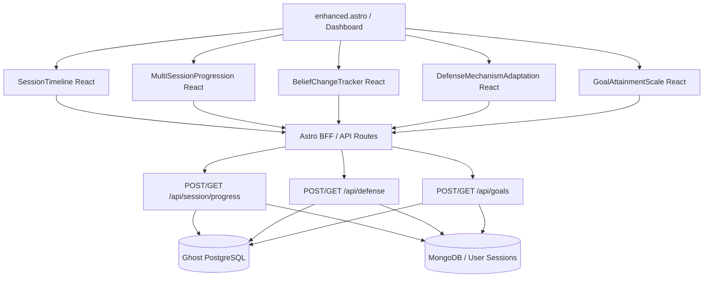

# Design Spec: Session Progress Tracking & Multi-Session Progression Metrics (PIX-3916)

## 1. Goal & Context
The goal is to implement robust session progress tracking and multi-session progression metrics for the Pixelated Empathy therapy platform. Currently, the workspace contains basic API routes for saving progress snapshots, but the frontend lacks corresponding visualization components to render these metrics. Furthermore, database pools are instantiated on every request in several API routes, which can exhaust connection slots in production.

This specification outlines the architecture, visual designs, database queries, and code organization required to complete PIX-3916.



---

## 2. Requirements & UI Mockups

### Visual Components (NP/Design System Compliant)
We will follow the minimal, zero-chroma, premium aesthetic documented in `TASTES.md` and the `np-*` design tokens system (flat, rule-divided, typography-driven, no generic colors, utilizing CSS transitions for interactive feedback).

#### A. Session Timeline (`SessionTimeline.tsx`)
* **Purpose**: Displays a vertical line connecting major events, highlights breakthrough moments, changes in emotional distress, and notes.
* **Layout**:
  - Vertical ruled line (`border-l-2 border-line-strong`).
  - Staggered timeline markers with indices.
  - Breakthrough moments carry a subtle caution accent (`np-status-caution-rule`).
  - Text: Date, session ID, notes, and emotional intensity.

#### B. Multi-Session Progression (`MultiSessionProgression.tsx`)
* **Purpose**: Displays trends across multiple sessions.
* **Visuals**:
  - Sparklines or clean SVG line charts showing:
    - Message counts / duration of sessions.
    - Emotional distress rating (e.g., anxiety or depression scores).
    - Cognitive behavioral therapy (CBT) exercises completed.

#### C. Belief Change Tracker (`BeliefChangeTracker.tsx`)
* **Purpose**: Tracks how core beliefs change over time (utilizing data from `BeliefConsistencyService`).
* **Visuals**:
  - Lists core beliefs (e.g. *"I am not good enough"*, *"The world is unsafe"*).
  - Shows progress sliders/gauges indicating strength of belief (e.g. from `9/10` in session 1 down to `3/10` in session 5).

#### D. Defense Mechanism Adaptation (`DefenseMechanismAdaptation.tsx`)
* **Purpose**: Displays the prominence of key defense mechanisms (denial, projection, intellectualization, rationalization, splitting) and their adaptation.
* **Visuals**:
  - Radar-like SVG or clean multi-line bar indicators comparing baseline levels vs. current session levels.

#### E. Goal Attainment Scale (`GoalAttainmentScale.tsx`)
* **Purpose**: Charts progress against goals defined in the `TherapeuticGoal` schema.
* **Visuals**:
  - A grid of progress indicators matching each category (`symptom_reduction`, `cognitive_restructuring`, etc.).
  - Checkpoint items (to-do lists) that can be toggled to trigger progress updates.

---

## 3. Database Schema & API Integration

### Session Table Columns
The existing PostgreSQL `sessions` table contains columns for:
* `progress_metrics`: JSONB matching `{ totalMessages: number, progress: number }`
* `progress_snapshots`: JSONB array of snapshots `{ timestamp: string, value: number }`
* `skill_scores`: JSONB mapping `{ "Active Listening": number, ... }`

We will add a new collection/table or JSONB column for defense mechanisms under `defense_metrics` if needed, or query them via the `GET /api/session/progress` route.

### Global connection Pool Hygiene
Rather than importing `Pool` from `pg` and instantiating a new instance in every file:
```typescript
import { query } from '@/lib/db'
// We will replace raw pools with the shared query utility which utilizes the OptimizedConnectionPool singleton
```

---

## 4. Proposed Changes & Implementation Phases

### Phase 1: Global pg Pool Integration
* Update `src/pages/api/session/progress.ts`, `src/pages/api/session/analytics.ts`, `src/pages/api/session/skills.ts`, and `src/pages/api/session/snapshots.ts` to import the centralized `query` or connection client from `src/lib/db/index.ts`.
* Run Vitest suite (`pnpm vitest run src/tests/api/session/progress-api.test.ts`) to ensure zero regression.

### Phase 2: Add Defense metrics API
* Create `src/pages/api/defense.ts` implementing:
  - `GET`: Retrieve a history of defense mechanism metrics for a patient.
  - `POST`: Log new defense mechanism scores (denial, splitting, rationalization, etc.) for a session.
* Add unit/integration tests for the new endpoint.

### Phase 3: Build React Components
* Refactor `src/components/chat/SessionTimeline.tsx` to implement a premium visual vertical timeline.
* Create:
  - `src/components/chat/MultiSessionProgression.tsx` (using SVG canvas for line-graphs).
  - `src/components/chat/BeliefChangeTracker.tsx` (collapsible list with sliders).
  - `src/components/chat/DefenseMechanismAdaptation.tsx` (bar comparison).
  - `src/components/chat/GoalAttainmentScale.tsx` (to-do check list and progress circle).
* Register components in `src/lib/utils/dynamic-components.ts` for dynamic/lazy loading.

### Phase 4: Dashboard Integration
* Update `src/pages/dashboard/enhanced.astro` to render the newly created components when `mode=analytics` or `mode=therapist`.
* Create a dedicated `/dashboard/session-progress` page (`src/pages/dashboard/session-progress.astro`) for deep-dives.

---

## 5. Verification Plan

### Automated Tests
1. **API tests**: Run `pnpm vitest run src/tests/api/session/progress-api.test.ts` to ensure database reads/writes work.
2. **Build and Typecheck**: Run `pnpm typecheck` and `pnpm build` to guarantee zero compile-time warnings/errors are introduced in modified files.
3. **E2E tests**: Write and run Playwright browser tests under `tests/e2e/session-progress.spec.ts` verifying UI component render and state interaction.
